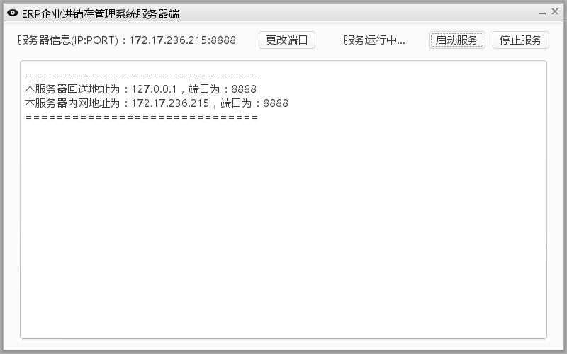

# ERPServer
Deworm的软工二大作业：进销存管理系统服务端

开发团队：Deworm

团队成员：

- [tomato990(对座)](https://github.com/tomato990)
- [vboar](https://github.com/vboar)
- [JaneLdq](https://github.com/JaneLdq)
- [oneoneO1](https://github.com/oneoneO1)

结合ERPClient使用.

可以以eclipse项目导入，也可以以maven项目导入。

注意：以maven项目导入需要自行添加lib文件夹中的包。

服务器截图：

